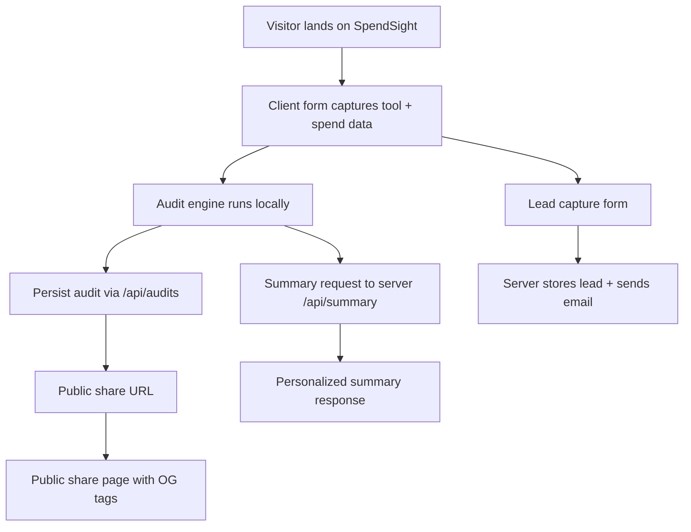

# Architecture

## Data flow
1. The user selects tools, plans, spend, seats, team size, and use case.
2. The client audit engine calculates per-tool recommendations and savings totals.
3. The client requests a personalized summary from the server (Anthropic API or fallback).
4. The client stores the audit result to get a shareable public URL.
5. The user optionally submits an email to save the report; the server stores the lead and sends a confirmation email.
6. Shared URLs render server-side HTML with OG tags and redirect to the client share view.

## Stack choice
- **Frontend:** Vite + React + TypeScript for fast iteration and performance.
- **Backend:** Express + MongoDB Atlas for a lightweight API and flexible schemas.
- **Email:** Resend for simple transactional email delivery.

## Scaling to 10k audits/day
- Add Redis for rate limiting and request caching.
- Move audit storage to a managed Postgres with row-level security for share URLs.
- Queue summary generation (e.g., SQS + worker) to reduce API latency.
- Generate OG images asynchronously and cache them at the CDN edge.
- Add observability (OpenTelemetry) and structured logging.
